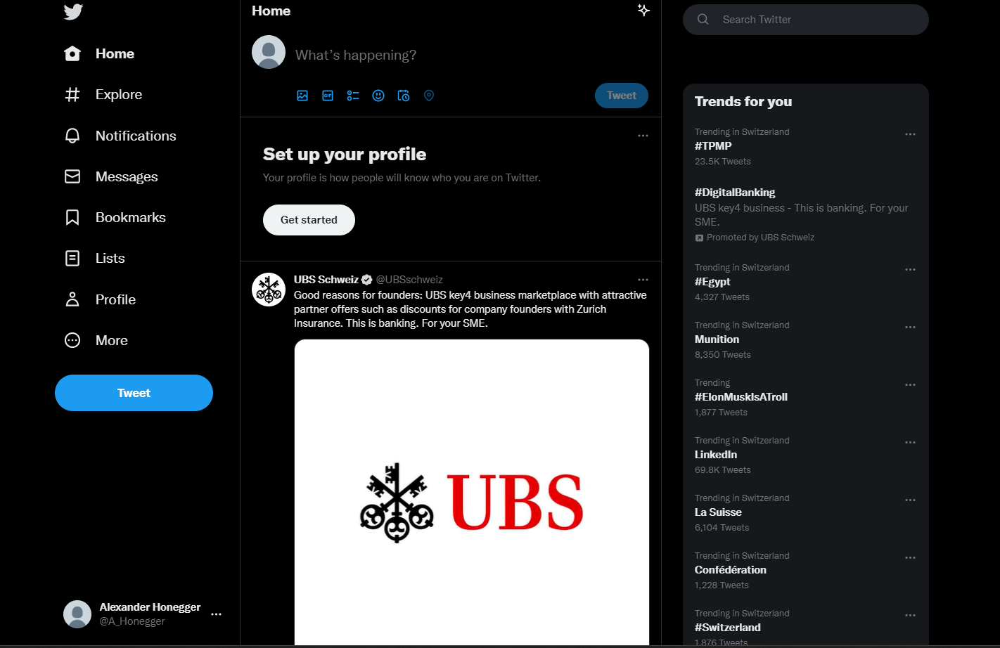

Posts:

    -Create endpoints
        -get all posts
        -get user posts
        -get friends posts
        -get followers posts
        -filter posts by category, content, user
        -edit user posts
        -delete user posts
        -share user posts
        -liked will be a dic on the backend with key being "id" and value "quantity"

Posts should look something like this
    
    -I think one posts at a time would be best, otherwise it's a bit overwhelming 

User: Profile should be user-friendly (styling and stuff is you guys)
    
    -User enpoints
        -Get user information
        -edit user information
        -get friends
        -get followers
        -get badges also backend dic with key value pair like posts
        -get stats (points, followers, answers)
        -generate code to invite people 

    -User Model
        -username
        -email
        -password
        -repeat password
        -description
        -points
        -badges
        -friends
        -followers
        -groups
        -job
        -phone
        -city
        -posts (related-name)
        -answers (related-name)
        -comments (related-name)
        

Registration:

    -Registration enpoints
        -request invitation code
        -request User who invited
    -Registration frontend
        -Darked themed, Ominous 
        -nothing other then the input fields and a wellcome message 
        -User has to provide:
            -username
            -password
            -repeat password    
            -Registration code
            -work
            -User who invited

Login:
        
    -Request email and password
    -gives token and moves to the posts pages

Singe Post Page

    -get post by id 
    -get answers and meme answers
    -can edit post
    -can receive badges
    -user information
    -description
    -title
    