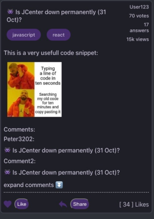

Posts:

    -Create endpoints
        -get all posts
        -get user posts
        -get friends posts
        -get followers posts
        -filter posts by category, content, user
        -edit user posts
        -delete user posts
        -share user posts
        -liked will be a dic on the backend with key being "id" and value "quantity"

Posts should look something like this

User: Profile should be user-friendly (styling and stuff is you guys)
    
    -User enpoints
        -Get user information
        -edit user information
        -get friends
        -get followers
        -get badges also backend dic with key value pair like posts
        -get stats (points, followers, answers)

Registration:

    -Registration enpoints
        -request invitation code
        -request User who invited

Login:
        
    -Request email and password
    -gives token and moves to the posts pages

